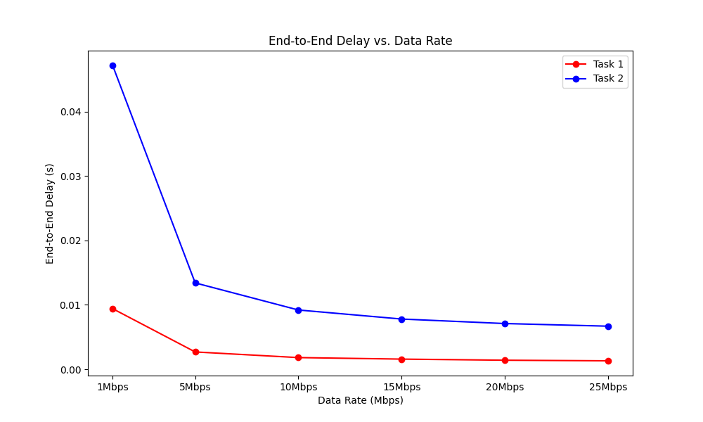

# NS3 Simulation Projects: Performance Analysis of Point-to-Point Topologies  

This repository contains simulation projects completed as coursework for a wireless system design class. The goal was to analyze network performance under various conditions using NS3.  

---

## **Tasks Overview**  

### **Task One**:  
- **Objective**: Analyze the performance of a two-node point-to-point topology by varying parameters.  
- **Modified Parameters**:  
  - Propagation Delay: 1ms  
  - Packet Transmission Interval: 0.5s  
  - Maximum Packets: 200  
  - Data Rates: 1Mbps, 5Mbps, 10Mbps, 15Mbps, 20Mbps, 25Mbps  
- **Results**:  
  - **Throughput**: Constant at 160bps across all data rates.  
  - **End-to-End Delay**: Reduced significantly as the data rate increased.  

#### **Graphs for Task One**  
  
*Throughput remains constant across all data rates and e2edelay reduces as datarate increases.*  

---

### **Task Two**:  
- **Objective**: Extend the topology to four nodes and analyze the impact on performance.  
- **Configuration**:  
  - Source: Node 0  
  - Destination: Node 3  
  - Same parameters as Task One.  
- **Results**:  
  - **Throughput**: Constant at 320bps for all data rates.  
  - **End-to-End Delay**: Increased due to the additional nodes.  

#### **Graphs for Task Two**  
  
*Higher throughput and delay compared to Task One due to doubled node count.*   

---

## **Comparison Between Tasks**  
  
*Task Two shows double throughput compared to Task One.*  

  
*Task Two experiences higher delays due to increased node count.*  

---

## **Key Insights**  
1. Higher data rates significantly reduce end-to-end delay in both tasks.  
2. Increasing the number of nodes negatively impacts system performance, leading to higher delays.  
3. Throughput remains constant as no packet drops occur during the simulation.  

---

## **Prerequisites**  
- Network Simulator 3 (NS3): Ensure NS3 is installed and configured.  
- Required Python Libraries: Run `pip install matplotlib` for plotting.  

---

## **Scripts Used**  
- `firstT1.sh`: Bash script for automating data rate testing in Task One.  
- `pyfirst1.py`: Python script for parsing results, calculating metrics, and generating graphs.  
- `firstT2.sh`: Bash script for automating data rate testing in Task Two.  
- `pyfirst2.py`: Python script for parsing results, calculating metrics, and generating graphs for Task Two.  

---

## **How to Run**  
1. Clone the repository:  
   ```bash
   git clone https://github.com/Coldsummers/cwt1-2.git
   cd cwt1-2
   ```  
2. Grant execution permissions to run shell scripts:  
   ```bash
   chmod +x firstT1.sh
   chmod +x firstT2.sh
   ```  
3. Run the shell scripts to execute the simulation:  
   ```bash
   ./firstT1.sh
   ./firstT2.sh
   ```  

---

## **License**  
This project is licensed under the MIT License.
